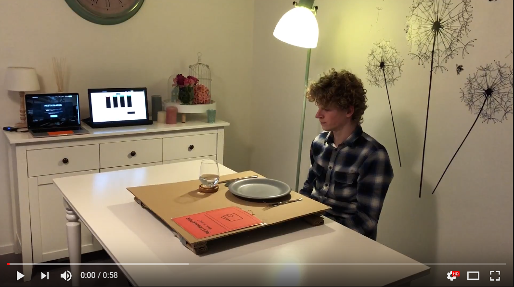

# Restaumator
## = [Restaurant automator]
http://restaumator.com/ 

Our application allows you to automate your restaurant! 
No more clients staring around, looking for a waiter! 
If glasses become empty, waiters will get automatic notifications to provide the customer with an extra drink!
### Promo
http://www.youtube.com/watch_popup?v=mxV8K7mM3-0

### Live
http://www.youtube.com/watch_popup?v=Xt9YNxKBp6k

Creators: [Alessandro Aussems](https://github.com/alessandroaussems) &amp; [Robbert Luit](https://github.com/RobLui) 
